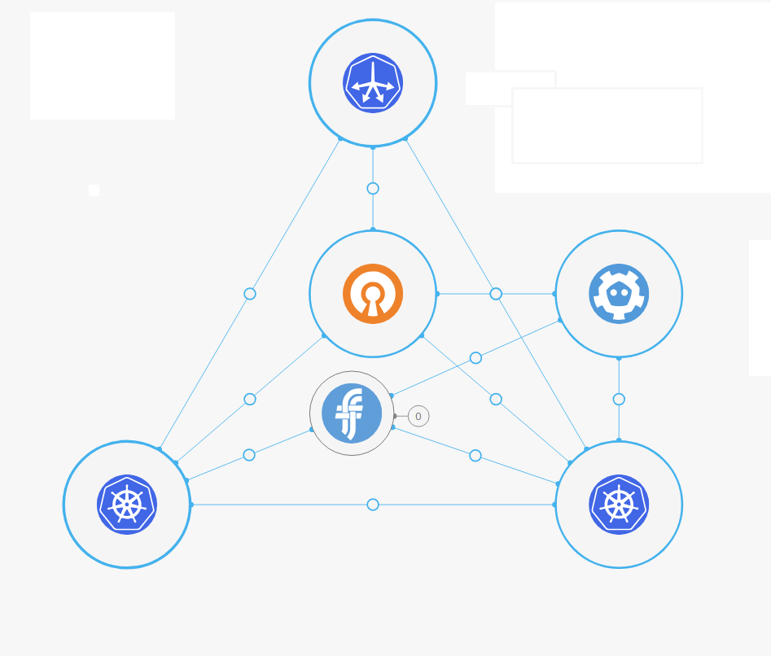

    

        

<h2> Introducing the Canonical Distribution of Kubernetes&reg;</h2>

The Canonical Distribution of Kubernetes&reg; (CDK), is pure Kubernetes tested across
the widest range of clouds with modern metrics and monitoring, brought to you by the people who
deliver Ubuntu.

Google, Microsoft, and many other institutions run Kubernetes on Ubuntu because we focus on the latest container capabilities in modern kernels. That’s why it’s the top choice for enterprise Kubernetes, too.

<a href="/kubernetes-docs/overview.html">Find out more in the CDK overview&nbsp;&rsaquo;</a>

    

        

            

                <h2>Getting started</h2>
                

                
<a href="/quickstart.html">Getting started with the Canonical Distribution of Kubernetes&reg; &nbsp;&rsaquo;</a>

            

            

                
            

        

        

        

            

                <h2>What's new</h2>
                <ul class="p-list">

                <li class="p-list__item"><a href="/news.html"> Version 1.12 released</a></li>
  <!--                 
                     <li class="p-list__item"><a class="post-link" href="{{ post.url | prepend: site.baseurl }}">{{ post.title }}&nbsp;&rsaquo;</a></li>
                        
-->
                </ul>
            

            

                <h2>Tutorials</h2>
                <ul class="p-list">
                    <li class="p-list__item"><a href="https://tutorials.ubuntu.com/tutorial/get-started-kubeflow#0">get started with Kubeflow&nbsp;&rsaquo;</a></li>
                </ul>
            

        

        


